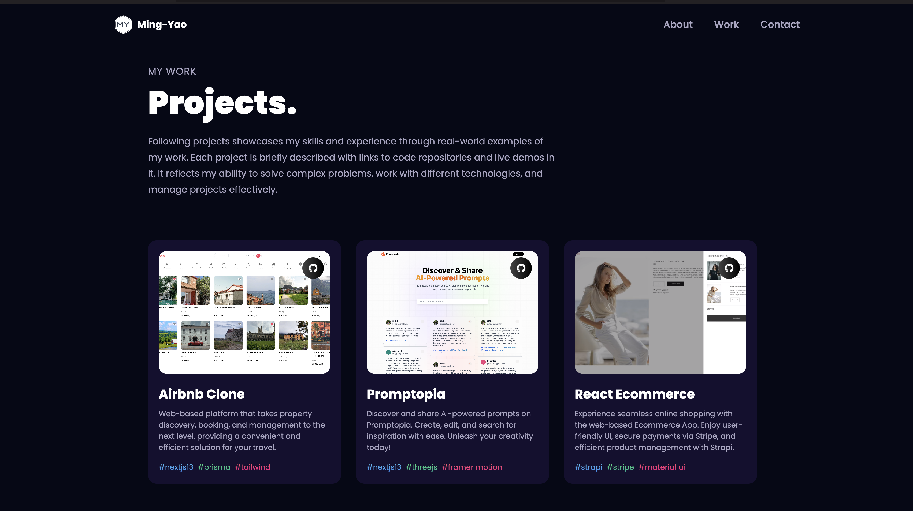

# 3D Portfolio with React.js

[Visit Website](https://3d-portfolio-xuauul.vercel.app) | [Watch Demo Video]()

Welcome to the 3D Portfolio project! This repository showcases a web-based 3D portfolio built using React.js and other cutting-edge technologies.

## Introduction

The 3D Portfolio is a visually captivating platform that allows users to explore various 3D models, scenes, and animations, providing an immersive user experience. Powered by React.js and Three.js library, this portfolio infuses dynamism and creativity into the display of projects and works.

## Technologies Used

The project is built using the following technologies:

- React.js
- Three.js
- React Three Fiber
- Tailwind CSS
- Framer Motion
- Vercel

## Features

- Integration of Three.js library to create interactive 3D models and scenes.
- Utilization of React Three Fiber for smooth rendering and animation controls.
- Incorporation of Framer Motion to introduce subtle and captivating animations.
- Visually appealing and responsive design using Tailwind CSS.
- Seamless deployment on Vercel for easy access and sharing.
